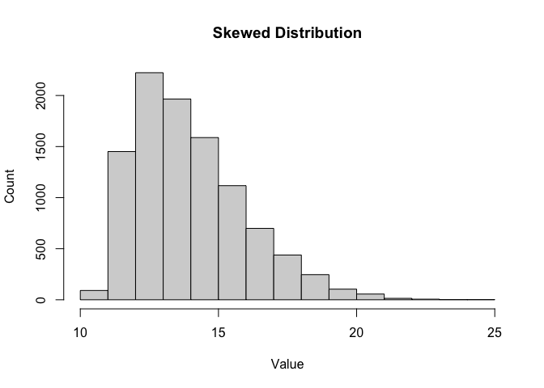
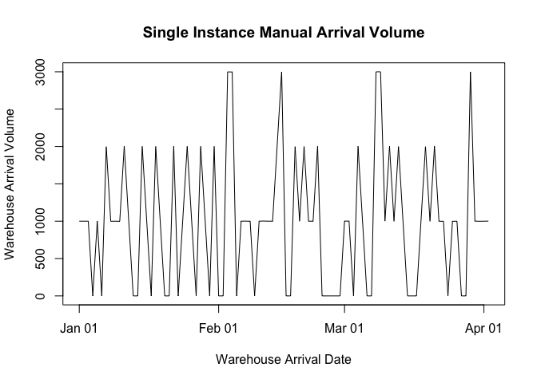
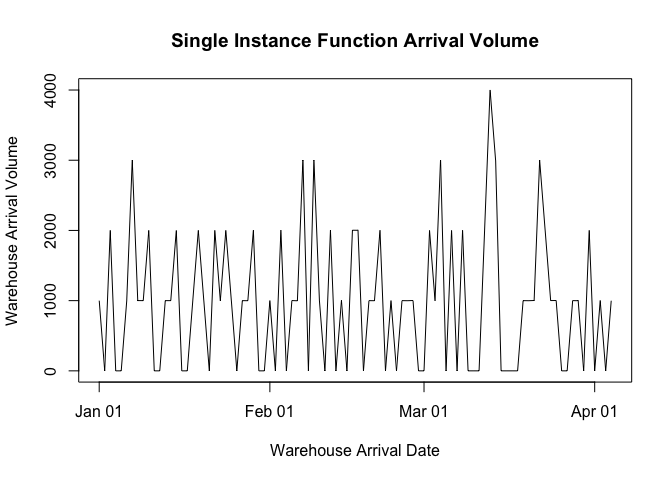
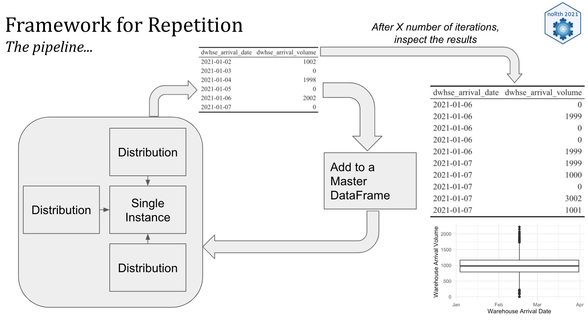
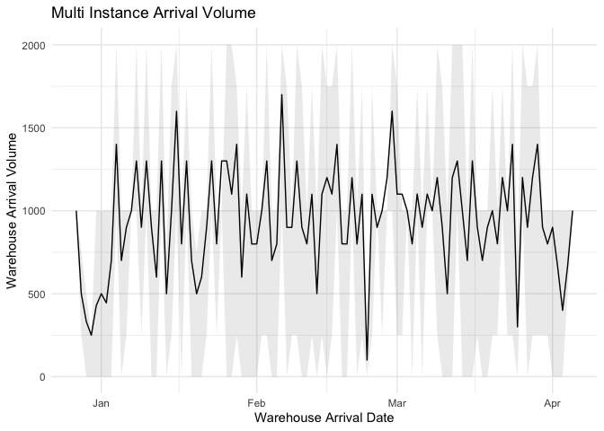
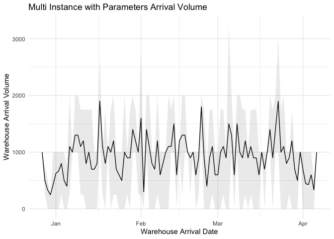
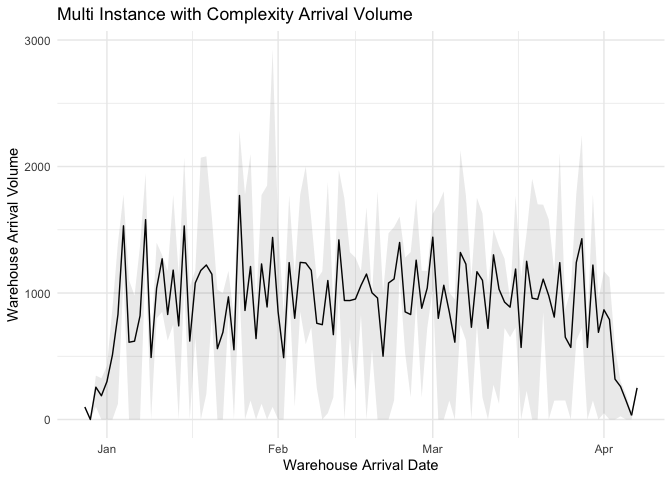
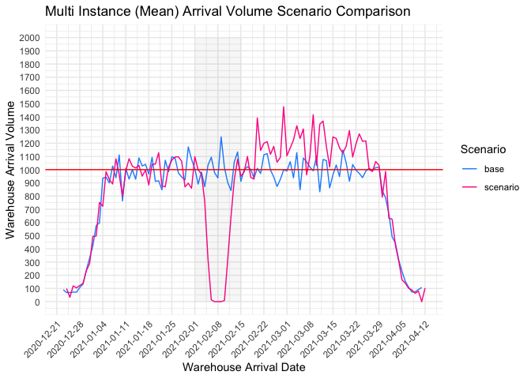

This markdown doc <em>slowly</em> walks through an example of building a monte carlo simulation to understand the impact of port delays in a global supply chain. The commentary is heavy, but <mark>the main-est points are highlighted in yellow</mark>. The pre-read to this markdown is a Google Slides doc found here. 

## Building Blocks - Creating Distributions

Of course, <mark>distributions are the building blocks of monte carlo sim</mark>. As such, we need to know how to create them and sample them. R gives us some fantastic abilities to create different kinds of distributions. We can create normal distributions, of course... but we can also easily create longer tail, skewed distributions (and all sort of distributions outlined in this blog post). First things first; lets sample 1 observation from a normal distribution with a mean of 14 and standard deviation of 2.


```r
rnorm(1, 14, 2) # single value, normal
```

```
## [1] 13.26136
```

Now, lets sample ten thousand observations and plot it to ensure it does, indeed, give us a normal distribution of values around the mean value of 14.


```r
n_df <- data.frame(values = rnorm(10000, 14, 2)) # many values, normal
hist(n_df$values, xlab = "Value", ylab = "Count", main = "Normal Distribution")
```

<!-- -->

Yup. Good stuff. Now, we need non-normal distributions. In particular, <mark>I want right tailed distributions. In supply chain, it makes sense that things can be late (and sometimes very late), but they are rarely very early.</mark> For this we leverage the fGarch package. The syntax is nearly the same as the normal distribution function above... but we have an additional parameter, xi, that let's us define how long the tail is. 


```r
r_df <- data.frame(values = rsnorm(10000, mean = 14, sd = 2, xi = 2.5)) # many values, tail
hist(r_df$values, xlab = "Value", ylab = "Count", main = "Skewed Distribution")
```

<!-- -->

<mark>When you are doing this in "real life", if possible, you will want to examine actual data from your business to determine what the distribution looks like.</mark> Great! Now lets string some of this distributions together to create our simulation.

## Single Instance

<mark>I believe it is healthy, when possible, to start with a single instance and build out from there. Additionally, I like to do it manually because it forces me to think through the process and verify the code is doing what I think it's doing.</mark>


```r
# * create date range ----
date_range <- rep(seq.Date(from=as.Date("2020-12-01"),
                           to=as.Date("2021-03-01"), by="day"), 1) # single port

# * create demand on each date ----
order_volume <- round(rnorm(length(date_range), 1000, 1), 0)

# * create transits ----
order_oport <- rsnorm(length(date_range), mean = 14, sd = 2, xi = 2.5)
oport_dport <- rsnorm(length(date_range), mean = 14, sd = 2, xi = 2.5)
dport_dwhse <- rsnorm(length(date_range), mean = 4, sd = 1, xi = 2.5)

# * calculate transit time ----
the_full_transit <- round(order_oport + oport_dport + dport_dwhse)

# * generate arrival date ----
dwhse_arrival_date <- date_range + the_full_transit

# * single instance dataframe ----
single_instance_manual <- data.frame(date_range, order_volume, order_oport,
                                     oport_dport, dport_dwhse, the_full_transit,
                                     dwhse_arrival_date)

# * show head of dataframe
head(single_instance_manual) %>%
  kbl(caption = "Single Instance Manual Dataframe") %>%
  kable_classic(full_width = F, html_font = "Cambria", position = "left")
```

<table class=" lightable-classic" style="font-family: Cambria; width: auto !important; ">
<caption>Single Instance Manual Dataframe</caption>
 <thead>
  <tr>
   <th style="text-align:left;"> date_range </th>
   <th style="text-align:right;"> order_volume </th>
   <th style="text-align:right;"> order_oport </th>
   <th style="text-align:right;"> oport_dport </th>
   <th style="text-align:right;"> dport_dwhse </th>
   <th style="text-align:right;"> the_full_transit </th>
   <th style="text-align:left;"> dwhse_arrival_date </th>
  </tr>
 </thead>
<tbody>
  <tr>
   <td style="text-align:left;"> 2020-12-01 </td>
   <td style="text-align:right;"> 1001 </td>
   <td style="text-align:right;"> 12.27641 </td>
   <td style="text-align:right;"> 19.52169 </td>
   <td style="text-align:right;"> 3.092947 </td>
   <td style="text-align:right;"> 35 </td>
   <td style="text-align:left;"> 2021-01-05 </td>
  </tr>
  <tr>
   <td style="text-align:left;"> 2020-12-02 </td>
   <td style="text-align:right;"> 1000 </td>
   <td style="text-align:right;"> 12.91258 </td>
   <td style="text-align:right;"> 15.32821 </td>
   <td style="text-align:right;"> 2.715433 </td>
   <td style="text-align:right;"> 31 </td>
   <td style="text-align:left;"> 2021-01-02 </td>
  </tr>
  <tr>
   <td style="text-align:left;"> 2020-12-03 </td>
   <td style="text-align:right;"> 1000 </td>
   <td style="text-align:right;"> 14.13229 </td>
   <td style="text-align:right;"> 12.10365 </td>
   <td style="text-align:right;"> 2.595275 </td>
   <td style="text-align:right;"> 29 </td>
   <td style="text-align:left;"> 2021-01-01 </td>
  </tr>
  <tr>
   <td style="text-align:left;"> 2020-12-04 </td>
   <td style="text-align:right;"> 1000 </td>
   <td style="text-align:right;"> 11.28733 </td>
   <td style="text-align:right;"> 13.98396 </td>
   <td style="text-align:right;"> 4.948148 </td>
   <td style="text-align:right;"> 30 </td>
   <td style="text-align:left;"> 2021-01-03 </td>
  </tr>
  <tr>
   <td style="text-align:left;"> 2020-12-05 </td>
   <td style="text-align:right;"> 1000 </td>
   <td style="text-align:right;"> 15.92855 </td>
   <td style="text-align:right;"> 13.51244 </td>
   <td style="text-align:right;"> 5.082913 </td>
   <td style="text-align:right;"> 35 </td>
   <td style="text-align:left;"> 2021-01-09 </td>
  </tr>
  <tr>
   <td style="text-align:left;"> 2020-12-06 </td>
   <td style="text-align:right;"> 999 </td>
   <td style="text-align:right;"> 11.68506 </td>
   <td style="text-align:right;"> 17.30408 </td>
   <td style="text-align:right;"> 3.693694 </td>
   <td style="text-align:right;"> 33 </td>
   <td style="text-align:left;"> 2021-01-08 </td>
  </tr>
</tbody>
</table>
Now, we can aggregate the volume by arrival date to see what the warehouse should plan to receive on each day in this instance.


```r
# NOTE: complete function from tidyr
sim <- single_instance_manual %>% group_by(dwhse_arrival_date) %>%
  summarise(dwhse_arrival_volume = sum(order_volume)) %>%
  complete(dwhse_arrival_date = seq.Date(min(dwhse_arrival_date), max(dwhse_arrival_date), by="day")) %>%
  mutate(dwhse_arrival_volume = coalesce(dwhse_arrival_volume, 0))

plot(sim$dwhse_arrival_date, sim$dwhse_arrival_volume, type='l',
     xlab = "Warehouse Arrival Date", ylab = "Warehouse Arrival Volume", main = "Single Instance Manual Arrival Volume")
```

<!-- -->

If you are responsible for warehouse planning, would you plan to receive 1,000 units per day? 2,000 units? Let's says you plan on 1,800. The next question is: <mark>how sure are you of these projections? The answer is not sure! This is only a single instance. We want to do this many more times to answer that second question. But before we do we want to create some functions so things stay organized.</mark>  

Before moving forward... the pipeline used to create the aggregate dataframe for that plot above - I'm going to use that a lot so it is useful to wrap it into a function itself. It will make the code more readable as we proceed. 


```r
agg_by_arrival_function <- function(the_dataframe) {
  
  hold_me <- the_dataframe %>%
    group_by(dwhse_arrival_date) %>%
    summarise(dwhse_arrival_volume = sum(order_volume)) %>%
    complete(dwhse_arrival_date = seq.Date(min(dwhse_arrival_date), max(dwhse_arrival_date), by="day")) %>%
    mutate(dwhse_arrival_volume = coalesce(dwhse_arrival_volume, 0))
  
  return(hold_me)
  
}

head(agg_by_arrival_function(single_instance_manual), 6) %>%
  kbl(caption = "Arrival Function Test Output") %>%
  kable_classic(full_width = F, html_font = "Cambria", position = "left")
```

<table class=" lightable-classic" style="font-family: Cambria; width: auto !important; ">
<caption>Arrival Function Test Output</caption>
 <thead>
  <tr>
   <th style="text-align:left;"> dwhse_arrival_date </th>
   <th style="text-align:right;"> dwhse_arrival_volume </th>
  </tr>
 </thead>
<tbody>
  <tr>
   <td style="text-align:left;"> 2021-01-01 </td>
   <td style="text-align:right;"> 1000 </td>
  </tr>
  <tr>
   <td style="text-align:left;"> 2021-01-02 </td>
   <td style="text-align:right;"> 1000 </td>
  </tr>
  <tr>
   <td style="text-align:left;"> 2021-01-03 </td>
   <td style="text-align:right;"> 1000 </td>
  </tr>
  <tr>
   <td style="text-align:left;"> 2021-01-04 </td>
   <td style="text-align:right;"> 0 </td>
  </tr>
  <tr>
   <td style="text-align:left;"> 2021-01-05 </td>
   <td style="text-align:right;"> 1001 </td>
  </tr>
  <tr>
   <td style="text-align:left;"> 2021-01-06 </td>
   <td style="text-align:right;"> 0 </td>
  </tr>
</tbody>
</table>

## Wrap Single Instance in a Function

Everything we just did manually - lets wrap it in a function so we can run it repeatedly.


```r
# * create function ----
inner_sim <- function() {
  
  date_range <- rep(seq.Date(from=as.Date("2020-12-01"),
                             to=as.Date("2021-03-01"), by="day"), 1) # single port
  
  order_volume <- round(rnorm(length(date_range), 1000, 1), 0)
  order_oport <- rsnorm(length(date_range), mean = 14, sd = 2, xi = 2.5)
  oport_dport <- rsnorm(length(date_range), mean = 14, sd = 2, xi = 2.5)
  dport_dwhse <- rsnorm(length(date_range), mean = 4, sd = 1, xi = 2.5)

  the_full_transit <- round(order_oport + oport_dport + dport_dwhse)
  dwhse_arrival_date <- date_range + the_full_transit
  
  single_instance_function <- data.frame(date_range, order_volume, order_oport,
                                         oport_dport, dport_dwhse, the_full_transit,
                                         dwhse_arrival_date)
  
  return(single_instance_function)
  
}

# * verify inner sim output ----
single_instance_function <- inner_sim()
head(single_instance_function) %>%
  kbl(caption = "Single Instance Function Test Output") %>%
  kable_classic(full_width = F, html_font = "Cambria", position = "left")
```

<table class=" lightable-classic" style="font-family: Cambria; width: auto !important; ">
<caption>Single Instance Function Test Output</caption>
 <thead>
  <tr>
   <th style="text-align:left;"> date_range </th>
   <th style="text-align:right;"> order_volume </th>
   <th style="text-align:right;"> order_oport </th>
   <th style="text-align:right;"> oport_dport </th>
   <th style="text-align:right;"> dport_dwhse </th>
   <th style="text-align:right;"> the_full_transit </th>
   <th style="text-align:left;"> dwhse_arrival_date </th>
  </tr>
 </thead>
<tbody>
  <tr>
   <td style="text-align:left;"> 2020-12-01 </td>
   <td style="text-align:right;"> 1001 </td>
   <td style="text-align:right;"> 13.44265 </td>
   <td style="text-align:right;"> 12.10665 </td>
   <td style="text-align:right;"> 3.683083 </td>
   <td style="text-align:right;"> 29 </td>
   <td style="text-align:left;"> 2020-12-30 </td>
  </tr>
  <tr>
   <td style="text-align:left;"> 2020-12-02 </td>
   <td style="text-align:right;"> 1001 </td>
   <td style="text-align:right;"> 15.81848 </td>
   <td style="text-align:right;"> 12.29566 </td>
   <td style="text-align:right;"> 6.150281 </td>
   <td style="text-align:right;"> 34 </td>
   <td style="text-align:left;"> 2021-01-05 </td>
  </tr>
  <tr>
   <td style="text-align:left;"> 2020-12-03 </td>
   <td style="text-align:right;"> 1000 </td>
   <td style="text-align:right;"> 12.57658 </td>
   <td style="text-align:right;"> 11.55545 </td>
   <td style="text-align:right;"> 3.205895 </td>
   <td style="text-align:right;"> 27 </td>
   <td style="text-align:left;"> 2020-12-30 </td>
  </tr>
  <tr>
   <td style="text-align:left;"> 2020-12-04 </td>
   <td style="text-align:right;"> 1001 </td>
   <td style="text-align:right;"> 14.25658 </td>
   <td style="text-align:right;"> 13.02955 </td>
   <td style="text-align:right;"> 4.231432 </td>
   <td style="text-align:right;"> 32 </td>
   <td style="text-align:left;"> 2021-01-05 </td>
  </tr>
  <tr>
   <td style="text-align:left;"> 2020-12-05 </td>
   <td style="text-align:right;"> 1001 </td>
   <td style="text-align:right;"> 14.00102 </td>
   <td style="text-align:right;"> 16.12090 </td>
   <td style="text-align:right;"> 3.075186 </td>
   <td style="text-align:right;"> 33 </td>
   <td style="text-align:left;"> 2021-01-07 </td>
  </tr>
  <tr>
   <td style="text-align:left;"> 2020-12-06 </td>
   <td style="text-align:right;"> 1000 </td>
   <td style="text-align:right;"> 15.57560 </td>
   <td style="text-align:right;"> 13.03187 </td>
   <td style="text-align:right;"> 3.856558 </td>
   <td style="text-align:right;"> 32 </td>
   <td style="text-align:left;"> 2021-01-07 </td>
  </tr>
</tbody>
</table>

Just like above, we can visualize it to make sure it's sensible.


```r
sif <- agg_by_arrival_function(single_instance_function)
plot(sif$dwhse_arrival_date, sif$dwhse_arrival_volume, type='l',
     xlab = "Warehouse Arrival Date", ylab = "Warehouse Arrival Volume", main = "Single Instance Function Arrival Volume")
```

<!-- -->

Alas, it <em>is</em> sensible :) But, <mark>one instance is sort of useless. The real value comes from doing it over and over to see what typically happens and what could happen (given our assumptions).</mark>

## Multiple Instances

Now, the next step is to run the single instance function many times. <mark>Mentally, for me, this took some time to grasp. So, if you don't get it at first glance... don't get discouraged. Eventually, it becomes a natural thought processes. Everything takes practice.</mark> Before more code, recall the framework:




```r
outer_sim <- function(n=10) {
  
  master_data_frame <- data.frame(dwhse_arrival_date = as.Date(character()),
                                  dwhse_arrival_volume = double())  
  
  for (i in 1:n) {
    
    hold <- inner_sim()
    
    single_aggregate <- agg_by_arrival_function(hold)
    
    master_data_frame <- rbind(master_data_frame, single_aggregate)
    
  }
  
  return(master_data_frame)
  
}

test_outer_sim <- outer_sim() %>% as.data.frame()
test_outer_sim_smaller <- test_outer_sim[test_outer_sim$dwhse_arrival_date == as.Date("2021-01-10"),]
test_outer_sim_smaller %>%
  kbl(caption = "Multi Instance Function Test Output") %>%
  kable_classic(full_width = F, html_font = "Cambria", position = "left")
```

<table class=" lightable-classic" style="font-family: Cambria; width: auto !important; ">
<caption>Multi Instance Function Test Output</caption>
 <thead>
  <tr>
   <th style="text-align:left;">   </th>
   <th style="text-align:left;"> dwhse_arrival_date </th>
   <th style="text-align:right;"> dwhse_arrival_volume </th>
  </tr>
 </thead>
<tbody>
  <tr>
   <td style="text-align:left;"> 12 </td>
   <td style="text-align:left;"> 2021-01-10 </td>
   <td style="text-align:right;"> 999 </td>
  </tr>
  <tr>
   <td style="text-align:left;"> 105 </td>
   <td style="text-align:left;"> 2021-01-10 </td>
   <td style="text-align:right;"> 998 </td>
  </tr>
  <tr>
   <td style="text-align:left;"> 203 </td>
   <td style="text-align:left;"> 2021-01-10 </td>
   <td style="text-align:right;"> 1000 </td>
  </tr>
  <tr>
   <td style="text-align:left;"> 297 </td>
   <td style="text-align:left;"> 2021-01-10 </td>
   <td style="text-align:right;"> 0 </td>
  </tr>
  <tr>
   <td style="text-align:left;"> 390 </td>
   <td style="text-align:left;"> 2021-01-10 </td>
   <td style="text-align:right;"> 0 </td>
  </tr>
  <tr>
   <td style="text-align:left;"> 482 </td>
   <td style="text-align:left;"> 2021-01-10 </td>
   <td style="text-align:right;"> 0 </td>
  </tr>
  <tr>
   <td style="text-align:left;"> 578 </td>
   <td style="text-align:left;"> 2021-01-10 </td>
   <td style="text-align:right;"> 1001 </td>
  </tr>
  <tr>
   <td style="text-align:left;"> 669 </td>
   <td style="text-align:left;"> 2021-01-10 </td>
   <td style="text-align:right;"> 1998 </td>
  </tr>
  <tr>
   <td style="text-align:left;"> 764 </td>
   <td style="text-align:left;"> 2021-01-10 </td>
   <td style="text-align:right;"> 1997 </td>
  </tr>
  <tr>
   <td style="text-align:left;"> 865 </td>
   <td style="text-align:left;"> 2021-01-10 </td>
   <td style="text-align:right;"> 0 </td>
  </tr>
</tbody>
</table>


```r
# first, prepare the data for ribbon chart
data_for_ribbon <- test_outer_sim %>%
  group_by(dwhse_arrival_date) %>%
  summarise(mean_count = mean(dwhse_arrival_volume),
            min_25_pct = quantile(dwhse_arrival_volume, 0.25),
            max_75_pct = quantile(dwhse_arrival_volume, 0.75)) %>%
  complete(dwhse_arrival_date = seq.Date(min(dwhse_arrival_date), max(dwhse_arrival_date), by="day")) %>%
  replace_na(list(mean_count = 0, min_25_pct = 0, max_25_pct = 0))

# create ribbon chart using 25th and 75th percentiles as min and max (consider this your likely)
ggplot(data_for_ribbon,
       aes(x = as.Date(dwhse_arrival_date), y = mean_count)) +
  geom_line() +
  theme_minimal() +
  geom_ribbon(aes(x = as.Date(dwhse_arrival_date), y = mean_count, ymin = min_25_pct, ymax = max_75_pct), alpha = 0.1) +
  labs(x = "Warehouse Arrival Date", y = "Warehouse Arrival Volume", title = "Multi Instance Arrival Volume")
```

<!-- -->

So, how do we get to a place where I can change different parts of the model to ask what-of questions? <mark>How do we get to scenario planning?</mark> In order to do that effectively, <mark>we want to add a bunch of parameters to the function.</mark>  

## Multiple Instances with Adjustable Parameters


```r
sim_function <- function(num_sims = 10, num_ports = 1,
                         start_date = as.Date("2020-12-01"),
                         end_date   = as.Date("2021-03-01"),
                         order_vol_mean = 1000, order_vol_var = 1,
                         oo_mean  = 14,   oo_var = 2,  oo_xi = 2.5,
                         od_mean  = 14,   od_var = 2,  od_xi = 2.5,
                         dw_mean  = 4,    dw_var = 1,  dw_xi = 2.5) {
  
  # outer sim (multi instance)
  master_data_frame <- data.frame(dwhse_arrival_date = as.Date(character()),
                                  dwhse_arrival_volume = double())  
  
  for (i in 1:num_sims) {
    
    # inner sim (single instance)
    date_range <- rep(seq.Date(from=start_date,
                               to=end_date, by="day"), num_ports)
    
    order_volume <- round(rnorm(length(date_range), order_vol_mean, order_vol_var), 0)
    order_oport <- rsnorm(length(date_range), mean = oo_mean, sd = oo_var, xi = oo_xi)
    oport_dport <- rsnorm(length(date_range), mean = od_mean, sd = od_var, xi = od_xi)
    dport_dwhse <- rsnorm(length(date_range), mean = dw_mean, sd = dw_var, xi = dw_xi)
    
    the_full_transit <- round(order_oport + oport_dport + dport_dwhse)
    dwhse_arrival_date <- date_range + the_full_transit
    
    single_instance_function <- data.frame(date_range, order_volume, order_oport,
                                           oport_dport, dport_dwhse, the_full_transit,
                                           dwhse_arrival_date)
    
    single_aggregate <- agg_by_arrival_function(single_instance_function)
    
    master_data_frame <- rbind(master_data_frame, single_aggregate)
    
  }
 
  return(master_data_frame)
  
}

test_me <- sim_function() %>% arrange(dwhse_arrival_date) %>% head(10)
test_me %>%
  kbl(caption = "Multi Instance Parameters Test Output") %>%
  kable_classic(full_width = F, html_font = "Cambria", position = "left")
```

<table class=" lightable-classic" style="font-family: Cambria; width: auto !important; ">
<caption>Multi Instance Parameters Test Output</caption>
 <thead>
  <tr>
   <th style="text-align:left;"> dwhse_arrival_date </th>
   <th style="text-align:right;"> dwhse_arrival_volume </th>
  </tr>
 </thead>
<tbody>
  <tr>
   <td style="text-align:left;"> 2020-12-29 </td>
   <td style="text-align:right;"> 1001 </td>
  </tr>
  <tr>
   <td style="text-align:left;"> 2020-12-30 </td>
   <td style="text-align:right;"> 1001 </td>
  </tr>
  <tr>
   <td style="text-align:left;"> 2020-12-30 </td>
   <td style="text-align:right;"> 0 </td>
  </tr>
  <tr>
   <td style="text-align:left;"> 2020-12-31 </td>
   <td style="text-align:right;"> 998 </td>
  </tr>
  <tr>
   <td style="text-align:left;"> 2020-12-31 </td>
   <td style="text-align:right;"> 0 </td>
  </tr>
  <tr>
   <td style="text-align:left;"> 2020-12-31 </td>
   <td style="text-align:right;"> 0 </td>
  </tr>
  <tr>
   <td style="text-align:left;"> 2020-12-31 </td>
   <td style="text-align:right;"> 1000 </td>
  </tr>
  <tr>
   <td style="text-align:left;"> 2021-01-01 </td>
   <td style="text-align:right;"> 999 </td>
  </tr>
  <tr>
   <td style="text-align:left;"> 2021-01-01 </td>
   <td style="text-align:right;"> 0 </td>
  </tr>
  <tr>
   <td style="text-align:left;"> 2021-01-01 </td>
   <td style="text-align:right;"> 0 </td>
  </tr>
</tbody>
</table>

Ok, once again let's make sure everything looks like it's working with the new parameters of the function.


```r
# first, prepare the data for ribbon chart
data_for_ribbon <- sim_function() %>%
  group_by(dwhse_arrival_date) %>%
  summarise(mean_count = mean(dwhse_arrival_volume),
            min_25_pct = quantile(dwhse_arrival_volume, 0.25),
            max_75_pct = quantile(dwhse_arrival_volume, 0.75)) %>%
  complete(dwhse_arrival_date = seq.Date(min(dwhse_arrival_date), max(dwhse_arrival_date), by="day")) %>%
  replace_na(list(mean_count = 0, min_25_pct = 0, max_25_pct = 0))

# create ribbon chart using 25th and 75th percentiles as min and max (consider this your likely)
ggplot(data_for_ribbon,
       aes(x = as.Date(dwhse_arrival_date), y = mean_count)) +
  geom_line() +
  theme_minimal() +
  geom_ribbon(aes(x = as.Date(dwhse_arrival_date), y = mean_count, ymin = min_25_pct, ymax = max_75_pct), alpha = 0.1) +
  labs(x = "Warehouse Arrival Date", y = "Warehouse Arrival Volume", title = "Multi Instance with Parameters Arrival Volume")
```

<!-- -->

If you want to be conservative, plan closer to the arrival of 2000 units daily (this is a decent strategy if the cost of any delay is very high). 

## Everything Works; Now Add Complexity

<mark>Ports will slow down and recover. But they won't recover instantaneously.</mark> There is a mechanical max - which means they can only process so much backlog on a given day. It's essential to build that into the model.  


```r
delay_range <- seq.Date(from=as.Date("2021-01-01"),
                        to=as.Date("2021-01-15"), by="day")

sim_function <- function(num_sims = 10, num_ports = 10,
                         start_date = as.Date("2020-12-01"),
                         end_date   = as.Date("2021-03-01"),
                         order_vol_mean = 100, order_vol_var = 1,
                         oo_mean  = 14,   oo_var = 1,  oo_xi = 1.0,
                         od_mean  = 14,   od_var = 1,  od_xi = 1.0,
                         dw_mean  = 4,    dw_var = 1,  dw_xi = 1.0,
                         delay_range = c(), delay_mag = 0,
                         port_threshold = 2500) {
  
  # outer sim (multi instance)
  master_data_frame <- data.frame(dwhse_arrival_date = as.Date(character()),
                                  dwhse_volume = double()) 
  
  for (i in 1:num_sims) {
    
    # inner sim (single instance)
    date_range <- rep(seq.Date(from=as.Date("2020-12-01"),
                               to=as.Date("2021-03-01"), by="day"), num_ports)
    
    order_volume <- round(rnorm(length(date_range), order_vol_mean, order_vol_var), 0)
    order_oport <- round(rsnorm(length(date_range), mean = oo_mean, sd = oo_var, xi = oo_xi), 0)
    oport_dport <- round(rsnorm(length(date_range), mean = od_mean, sd = od_var, xi = od_xi), 0)
    
    ############################################################
    # new stuff to account for port backlog and mechanical max #
    ############################################################
    
    trans_port <- order_oport + oport_dport
    
    # data as in when it gets to the port
    port_data <- data.frame(date_range, order_volume, trans_port)
    port_data$port_arrival_date <- port_data$date_range + port_data$trans_port
    
    # if arrival to port date is within delay range, add delay magnitude
    port_data$port_arrival_date <- as.Date(port_data$port_arrival_date, format="%Y-%m-%d")
    port_data$port_arrival_date <- if_else(as.character(port_data$port_arrival_date) %in% as.character(delay_range),
                                           port_data$port_arrival_date + delay_mag,
                                           port_data$port_arrival_date)
    
    # aggregate up port arrival data
    port_agg <- port_data %>% mutate(port_arrival_date = as.character(port_arrival_date)) %>%
      group_by(port_arrival_date) %>%
      summarise(port_arrival_volume = sum(order_volume))
    
    # build a backlog
    # meter port volume
    cap <- port_threshold
    port_agg$adjusted_port_volume <- port_agg$port_arrival_volume
    for (i in 1:(nrow(port_agg)-1)) {
      if (port_agg$adjusted_port_volume[i] > cap) {
        leftover <- port_agg$adjusted_port_volume[i] - cap
        leftover <- ifelse(leftover < 0, 0, leftover)
        port_agg$adjusted_port_volume[i] <- cap
        port_agg$adjusted_port_volume[i+1] <- port_agg$adjusted_port_volume[i+1] + leftover
      }
    } 
    
    # add on the domestic transit component
    port_agg$dport_dwhse <- round(rsnorm(length(port_agg$port_arrival_date), mean = dw_mean, sd = dw_var, xi = dw_xi))
    port_agg$dwhse_arrival_date <- as.Date(port_agg$port_arrival_date) + port_agg$dport_dwhse
    
    # before aggregate, need to make names jive
    names(port_agg) <- c("port_arrival_date", "port_arrival_volume", "order_volume", "dport_dwhse", "dwhse_arrival_date")
    
    ###############################
    # end port backlog adjustment #
    ###############################
    
    single_instance_agg <- agg_by_arrival_function(port_agg)
    
    master_data_frame <- rbind(master_data_frame, single_instance_agg)
    
  }
  
  return(master_data_frame)
  
}

test_sim <- sim_function(num_sims       = 100,
                         order_vol_var  = 10,
                         oo_var         = 1,
                         od_var         = 0,
                         dw_var         = 0,
                         delay_range    = delay_range,
                         delay_mag      = 0,
                         port_threshold = 100000)

# first, prepare the data for ribbon chart
data_for_ribbon <- sim_function() %>%
  group_by(dwhse_arrival_date) %>%
  summarise(mean_count = mean(dwhse_arrival_volume),
            min_25_pct = quantile(dwhse_arrival_volume, 0.25),
            max_75_pct = quantile(dwhse_arrival_volume, 0.75)) %>%
  complete(dwhse_arrival_date = seq.Date(min(dwhse_arrival_date), max(dwhse_arrival_date), by="day")) %>%
  replace_na(list(mean_count = 0, min_25_pct = 0, max_25_pct = 0))

# create ribbon chart using 25th and 75th percentiles as min and max (consider this your likely)
ggplot(data_for_ribbon,
       aes(x = as.Date(dwhse_arrival_date), y = mean_count)) +
  geom_line() +
  theme_minimal() +
  geom_ribbon(aes(x = as.Date(dwhse_arrival_date), y = mean_count, ymin = min_25_pct, ymax = max_75_pct), alpha = 0.1) +
  labs(x = "Warehouse Arrival Date", y = "Warehouse Arrival Volume", title = "Multi Instance with Complexity Arrival Volume")
```

<!-- -->

## Create Scenarios


```r
delay_range <- seq.Date(from=as.Date("2021-02-01"),
                        to=as.Date("2021-02-15"), by="day")

sim_plan_1 <- sim_function(num_sims = 100, num_ports = 10,
                           delay_range   = delay_range,   delay_mag = 0,
                           order_vol_mean = 100, order_vol_var = 10,
                           oo_var = 2, od_var = 2, dw_var = 1,
                           port_threshold = 2000) %>%
  group_by(dwhse_arrival_date) %>%
  summarise(dwhse_arrival_volume = mean(dwhse_arrival_volume)) %>%
  mutate(sim = "base")

# for 14 day period, all units coming through port are delayed 7 days
# additionally, port's mechanical max is 1200 units per day
sim_plan_2 <- sim_function(num_sims = 100, num_ports = 10,
                           delay_range   = delay_range,   delay_mag = 7,
                           order_vol_mean = 100, order_vol_var = 10,
                           oo_var = 2, od_var = 2, dw_var = 1,
                           port_threshold = 1200) %>%
  group_by(dwhse_arrival_date) %>%
  summarise(dwhse_arrival_volume = mean(dwhse_arrival_volume)) %>%
  mutate(sim = "scenario")

sim_plan_comp <- rbind(sim_plan_1, sim_plan_2)

ggplot(sim_plan_comp, aes(x=dwhse_arrival_date, y=dwhse_arrival_volume, group=sim, color=sim)) +
  geom_line() +
  theme_minimal() +
  scale_color_manual(values=c("dodgerblue", "deeppink")) +
  scale_y_continuous(limits = c(0, 2000), breaks = seq(0, 2000, 100)) +
  scale_x_date(date_breaks = "1 week") +
  labs(x = "Warehouse Arrival Date", y = "Warehouse Arrival Volume", title = "Multi Instance (Mean) Arrival Volume Scenario Comparison", color ="Scenario") +
  theme(axis.text.x = element_text(angle = 45, hjust = 1)) +
  geom_hline(yintercept = 1000, color = "red") +
  annotate("rect", xmin = as.Date("2021-02-01"), xmax = as.Date("2021-02-15"),
           ymin = 0, ymax = 2000,
           alpha = .05)
```

<!-- -->

## The Most Important Things to Remember

1. <mark>Aggregating many independent instances to reveal possibilities is the key.</mark>
2. <mark>Make sure you validate the output of every step (remove randomness before adding randomness).</mark>
3. <mark>Domain expertise is as important as the code.</mark>
4. <mark>Before you begin, it is important to understand the decisions so you know what levers you should create in your model - otherwise, endless what-ifs.</mark>
4. <mark>If you want to calibrate your model, run it for historical periods to see where it performs well or fails.</mark>
