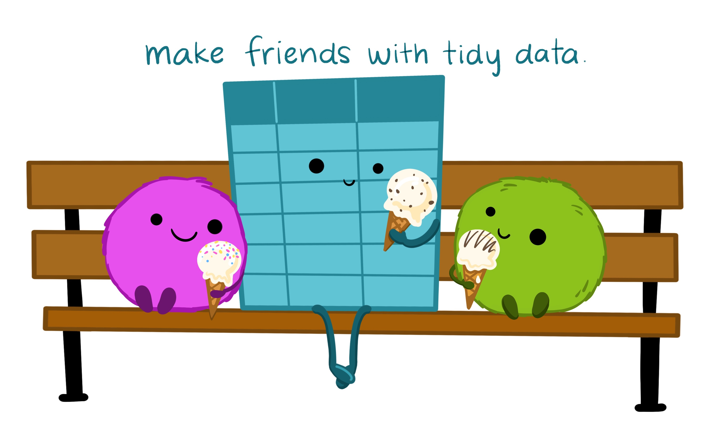
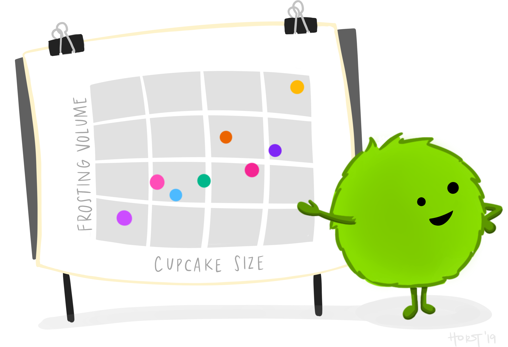

# Disclaimer

The views expressed in this presentation are strictly my own. They do not necessarily represent the position of the Federal Reserve Bank of Minneapolis or the Federal Reserve System.

---

# Goal of this tutorial

Introduce R tools that help you communicate a data story in a professional, sustainable, and beautiful way. 


---

# In this tutorial

- How to set up your R ecosystem to support report creation in HTML (and PDF)

--

- Examples of table and graphics packages to support analysis

--

- Tips and tricks to make your reports dazzling and reproducible


---

# Not in this tutorial

>- Shiny - we are going to focus on HTML (primary) and PDF (secondary) reports
>- Details of the tables or graphics packages - these could easily be their own tutorials

The good news is several speakers tomorrow will cover Shiny and other graphics applications!

---

# Older process of reporting

- Do analysis in one tool (R/SAS/SPSS/etc.)
--

- Make tables and charts in another tool (Excel)
--

- Paste everything into a text editor (Word/LaTeX)
--

- Turn it into a final product (PDF)
--
.center[

]

---

# Build an R ecosystem for Reporting


---

# Create workflows that shred

---

# R Project 

"R experts keep all the files associated with a project together — input data, R scripts, analytical results, figures. This is such a wise and common practice that RStudio has built-in support for this via projects." 

-- Hadley Wickham ([R for Data Science](https://r4ds.had.co.nz/workflow-projects.html))

--

R projects define your working directories:

  - Paths are relative rather than fixed
  - Your work is portable and tidy

---

# Let's do it!

 1. Open RStudio 
 2. Configure global options to avoid saving .Rdata
     - Tools -> Global Options -> Workspace -> Uncheck the box. Change the dropdown to Never.
     - Restart RStudio
 3. Create an R project to associate with this talk or another set of files

---

# Embrace the magic of R Markdown

.center[]

---

# What is R Markdown?

R code + Markdown (text-to-HTML conversion tool) = R Markdown

--

R Markdown files are designed to be used in three ways:

--
 - As an environment for you to do data science.
 
--

 - Collaborating with other data scientists with interest in your conclusions and how you reached them (the code).

--
 - **For communicating to decision makers, who want to focus on the conclusions, not the code behind the analysis.**

---

# Let's do it!

 1. File -> New File -> R Markdown -> Document -> HTML -> Save
 2. Knit it!
 3. Open the dazzle.Rmd file inside the tutorial folder
     - YAML Header
     - Code chunks
     - Markdown/LaTeX

---

# Dazzling Elements in R Markdown

 - Using parameters in YAML header
 - Hiding code chunks and including 'Easter eggs' for other analysts
 - Using tabs and drop downs to improve pagination
 - Adding meaningful color to output
 - [Style output using HTML themes](https://www.datadreaming.org/post/r-markdown-theme-gallery/)
   
---

# Folder Infrastructure

.pull-left[ 

- Store long R scripts separate from your R Markdown files
 
- Consider preprocessing and storage of summary data 
 
- Don't try to fit too much into one report; separate reports into their own folder
 ]

.pull-right[ 
 
 
 ]

---

# Why HTML

.pull-left[

]

--

.pull-right[
- HTML is *interactive* without being Shiny
- HTML is *portable* and everyone you know has a web browser to open it
- TeX overhead can be high for creation of pdf and RMD files may fail to knit in different environments 
]

---

# If you must PDF

 - As long as you are not using LaTeX outside of R, you can use a minimal install of TeX via the `tinytex` package
```r 
install.packages('tinytex')
tinytex::install_tinytex()
```
 - [TinyTeX is a custom LaTeX distribution based on TeX Live that is small in size](https://yihui.org/tinytex/)

 - YMMV: errors can accumulate especially if you don't have admin rights on your computer

---

# Step 3. Build your tabular content

There are many table packages. For HTML, `DT` and `reactable` are good starting points. For pdf, `kableExtra` is the gold standard.

.center[]

---

# Step 4. Build your graphical content

`ggplot2` works great as a static graphics package. For interactive graphics, use packages like `plotly` or `highcharter`.

.center[]

---

# Tips for Tables and Graphics

 - Create tables and graphics to support a narrative
     + Storyboard your ideas on paper or a whiteboard before diving in
 - Build the tables and graphics outside of R Markdown first to avoid extra loading overhead
 - Think about your user's needs
     + Do they like to download the data?
     + Are you using color in an intentional way? (1 in 12 men are colorblind)

---

# Additional UX principles for reporting

Your report should:

 - Have a clear hierarchy that makes navigation natural
 - Understand and embrace accessibility
 - Maintain time consistency - transition to or away from ideas slowly
 
---

# References and Thanks

 - Amazing artwork by Allison Horst sourced from: https://github.com/allisonhorst/stats-illustrations
     + First page artwork credit: "Updated from Grolemund & Wickham's classis R4DS schematic, envisioned by Dr. Julia Lowndes for her 2019 useR! keynote talk and illustrated by Allison Horst."
 - [R for Data Science](https://r4ds.had.co.nz/workflow-projects.html) 
 - [R Markdown Driven Development by Emily Riederer at rstudio::conf 2020](https://www.rstudio.com/resources/rstudioconf-2020/rmarkdown-driven-development/)

 

<style type="text/css">
.remark-slide-content {
    font-size: 30px;
    padding: 1em 1em 1em 1em;
}
</style>
